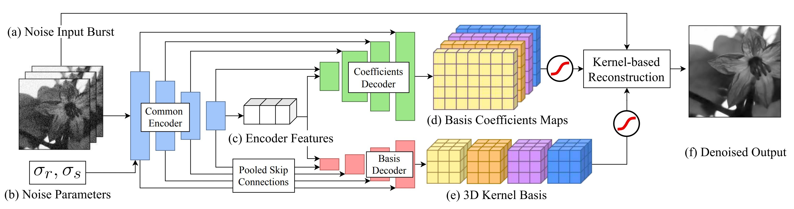

# Basis Prediction Networks for Effective Burst Denoising with Large Kernels
### [Project Page](https://www.cse.wustl.edu/~zhihao.xia/bpn) | [Video](https://youtu.be/jFubeqxJO6U) | [Paper](https://openaccess.thecvf.com/content_CVPR_2020/html/Xia_Basis_Prediction_Networks_for_Effective_Burst_Denoising_With_Large_Kernels_CVPR_2020_paper.html)
A Tensorflow 2 **re-implementation** of Basis Prediction Networks for Burst Denoising. The original source code of the paper was implemented in TF1, but could not be shared due to patent issues.<br>

[Basis Prediction Networks for Effective Burst Denoising with Large Kernels](https://www.cse.wustl.edu/~zhihao.xia/bpn) (CVPR 2020) <br>
 [Zhihao Xia](https://www.cse.wustl.edu/~zhihao.xia/)<sup>1</sup>,
 [Federico Perazzi](https://fperazzi.github.io/)<sup>2</sup>,
 [Michael Gharbi](https://www.mgharbi.com/)<sup>2</sup>,
 [Kalyan Sunkavalli](https://www.kalyans.org/)<sup>2</sup>,
 [Ayan Chakrabarti](https://projects.ayanc.org/)<sup>1</sup> <br>
<sup>1</sup>WUSTL, <sup>2</sup>Adobe Research



## Dependencies

Python 3 + Tensorflow-2.3

## Download pre-trained models
Our pre-trained models for grayscale and color burst denoising can be found [here](https://drive.google.com/file/d/1_-AFCj3G5ISJovdprVHvyeGt59hH2iKb/view?usp=sharing). You can run
```
bash ./scripts/download_models.sh
```
to download and unzip them.

## Download grayscale and color test sets
We use the grayscale test set provided by Mildenhall et al., which can be found [here](https://drive.google.com/open?id=1UptBXV4f56wMDpS365ydhZkej6ABTFq1). For color burst denoising test, we sythetically generate the test set with 100 images from the validation set of [Open Images Dataset](https://github.com/cvdfoundation/open-images-dataset). The noisy and clean bursts can be found [here](https://drive.google.com/file/d/1rXmauXa_AW8ZrNiD2QPrbmxcIOfsiONE/view?usp=sharing). You can also download both test sets by running
```
bash ./scripts/download_testset.sh
```

## Test with pre-trained models
Run 
```
python test.py [--color] [--gain NOISE_LEVEL]
```
to test grayscale and color burst denoising with pre-trained models on different noise levels.


## Training your own models
Our model is trained on the training set of the [Open Images Dataset](https://github.com/cvdfoundation/open-images-dataset). To train your own model, download the dataset and update `data/train.txt` and `data/val.txt` with path to each image. Then run
```
python train.py [--color]
```
You can press `ctrl-c` at any time to stop the training and save the checkpoints (model weights and optimizer states). The training script will resume from the latest checkpoint (if any) in the model directory and continue training.


## Citation
If you find the code useful for your research, we request that you cite the paper. Please contact zhihao.xia@wustl.edu with any questions.
```
@inproceedings{xia2020basis,
  title={Basis prediction networks for effective burst denoising with large kernels},
  author={Xia, Zhihao and Perazzi, Federico and Gharbi, Micha{\"e}l and Sunkavalli, Kalyan and Chakrabarti, Ayan},
  booktitle={Proceedings of the IEEE/CVF Conference on Computer Vision and Pattern Recognition},
  pages={11844--11853},
  year={2020}
}
```


## Acknowledgments
This work was supported by the National Science Foundation under award no. [IIS-1820693](https://www.nsf.gov/awardsearch/showAward?AWD_ID=1820693). Any opinions, findings, and conclusions or recommendations expressed in this material are those of the authors, and do not necessarily reflect the views of the National Science Foundation.


## License
This re-implementation is licensed under the MIT License.